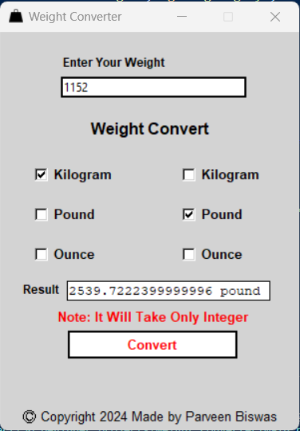
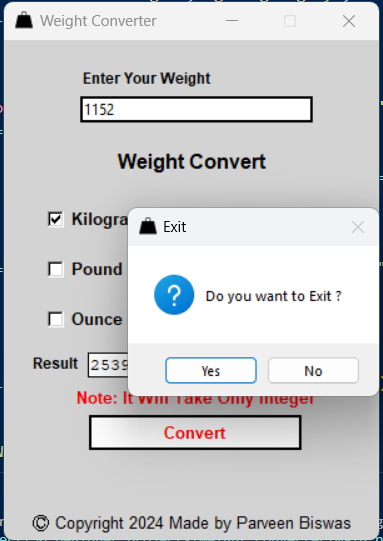

# Weight_Converter_GUI

<h3>Required Package for Build this Project</h3>
<h4>Tkinter
<li>Install Command : pip install tk</li>
</h4>
<h4>Pillow
<li>Install Command : pip install pillow</li>
</h4>

<h3>Code Output</h3>

